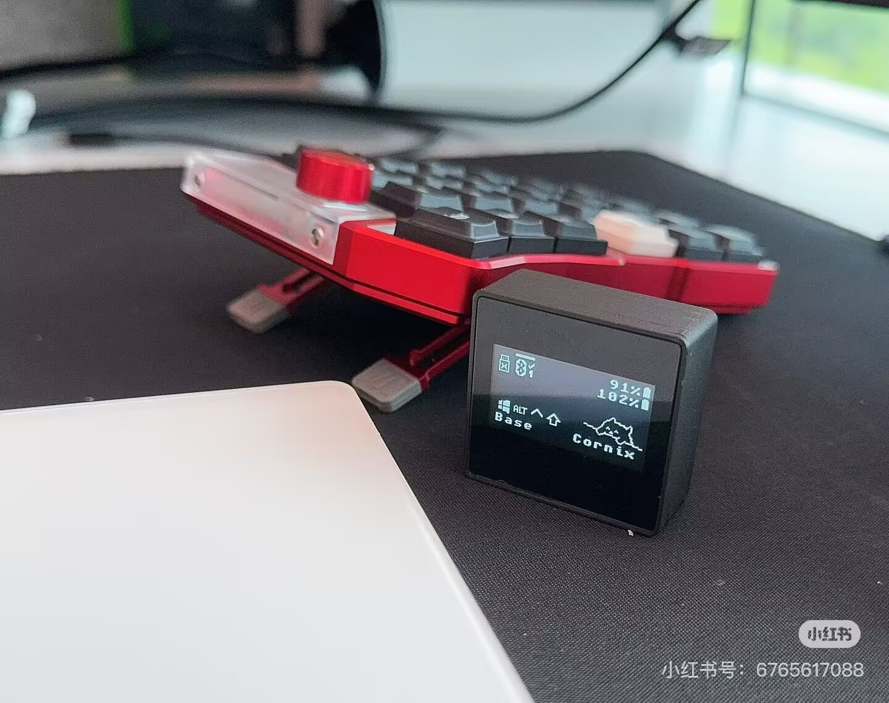
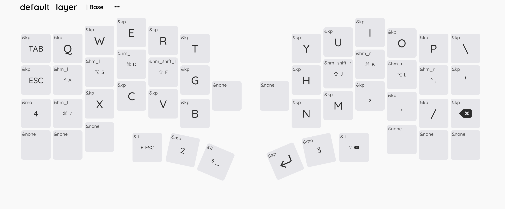

# ZMK Keyboard Cornix

## 开发板和扩展板介绍

本仓库包含用于 Cornix 分体式键盘的 ZMK 固件配置。以下是该项目中可用的不同开发板和扩展板的说明：

### 开发板

该项目包含三个主要的开发板定义：

- **`cornix_left`**: Cornix 分体式键盘的左半部分，用于在不使用适配器配置的情况下构建固件。
- **`cornix_right`**: Cornix 分体式键盘的右半部分，用于分体式键盘设置中的从设备侧。
- **`cornix_ph_left`**: 左半部分的替代开发板配置，专门设计用于适配器设置。

### 扩展板

该项目包含几个提供额外功能的专用扩展板：

- **`cornix_dongle_adapter`**: 为适配器配置提供矩阵和蓝牙功能的通用功能。在使用带有自定义适配器的 Cornix 时需要此扩展板。
- **`cornix_dongle_eyelash`**: 用于为适配器板设置显示设备的示例扩展板。当板子本身没有在设备树中包含 `zephyr,display` 时使用此扩展板。
- **`cornix_indicator`**: 启用 RGB LED 指示灯以显示电池状态和连接状态的扩展板。注意使用此扩展板会消耗更多电量。

---

这个社区固件已在使用 ZMK 的 Cornix 上进行了测试，并提供完整的分体角色配置、电池电源管理和蓝牙主/从设置，符合 ZMK 分体式指南




## 警告：设备损坏恢复

原始 Cornix 使用没有 SoftDevice 的闪存布局
因此在项目中，所有开发板默认使用无 SD 布局

如果你将固件刷入适配器并发现它无法与原始固件配合工作
你有两种解决方案

1. （推荐）在 bootloader 目录下刷入 sd 恢复 uf2 文件（适用于 nice nano 2，但我认为它适用于大多数 nrf52840 设备）其他开发板 https://github.com/hitsmaxft/Adafruit_nRF52_Bootloader/actions/runs/18398554358
2. 使用代码片段 'nrf52840-nosd' 构建你的固件，使 zmk 忽略软设备

## TODO 列表

- [x] 52 键完整布局键位图，自 v2.0
- [x] ec11 编码器，自 v2.2
- [x] 无 SD 镜像，自 v2.3
- [x] 支持各种适配器
- [x] 升级到 zephyr4.1 和 lvgl9，自 v2.7，暂不支持适配器屏幕
- [ ] RGB，将在未来 v3 中支持

### 关于 RGB

Cornix 扩展板每侧有 2 个 RGB LED，由 PWM 在原始固件中控制。

替代解决方案是采用 RGB 指示模块来点亮这些 RGB，以实现与原始固件相同的效果，原始固件使用 RGB LED 来指示电池状态和连接状态。

但此功能尚未在此仓库中支持。欢迎提交 PR！

## 支持的硬件：Cornix 分体式键盘

Cornix 分体式帐篷式低轮廓人体工学键盘 (Jezail 资助者)

Cornix 是一款受 Corne 启发的分体式人体工学键盘，具有紧凑的 3×6 列交错布局和六个拇指集群键（每半边三个）。它提供 10°、18° 和 25° 的可调帐篷角度，允许用户减少手腕压力并找到自定义的人体工学对齐

- **分体式、列交错布局** (3×6 + 拇指集群布局)。
- **可调帐篷支撑** 10°、18°、25°（基于硬件，无需固件黑科技）。
- **Kailh Choc V2 热插拔插座** 并支持 LAK 或 LCK 低轮廓键帽。
- **双模连接**：有线 USB-C 或蓝牙无线（左半边为主设备）。
- **固件**：完全支持 VIAL 进行键位图和层自定义，原始固件为 RMK。
- 高端 **CNC 加工铝制底盘**、定制减震泡沫和便携存储袋。

> 该项目所有者也是 RMK 贡献者，请支持 RMK https://rmk.rs/

## --Bootloader 恢复说明--

-- 原始 RMK 固件移除了 SoftDevice，因此在刷入 `zmk.uf2` 之前，您需要先恢复 SoftDevice。具体步骤请参见 [bootloader/README.md](./bootloader/README.md)。 --

自 v2.3 此板的闪存分区已更新，移除了 SD（将 SD 分区大小从 150K 减少到 4K），因此您可以直接刷入固件。

> 您可能需要通过早期版本的 reset.uf2 重置固件

> 您可以通过刷入原始 uf2 文件回滚到原始固件，在 rmkfw/ 下备份文件

## 🔰 简单方法：克隆此仓库并使用 GitHub Actions 构建

如果您是 ZMK 新手，不想处理 `west.yml` 或模块管理，您可以直接使用此仓库来自定义固件。

### 步骤

1. **Fork 或克隆此仓库**
   - 点击右上角的 **Fork** 将此仓库复制到您的 GitHub 账户，或
   - 本地运行 `git clone`。

   > 推荐 Fork，因为 GitHub Actions 会自动构建您的固件。

2. **编辑您的键位图**
   - 在 `config/cornix.keymap` 中找到键位图文件（或您想要自定义的任何 `.keymap` 文件）。
   - 您可以直接编辑，或使用 [ZMK 键位图编辑器](https://nickcoutsos.github.io/keymap-editor/)：
     - 打开编辑器并加载您的 `.keymap` 文件。
     - 使用可视化编辑器进行更改。
     - 下载更新后的文件并替换仓库中的文件。
     - 提交并推送到 GitHub。

3. **使用 GitHub Actions 构建**
   - 推送后，GitHub Actions 将自动运行构建。
   - 工作流完成后，转到 **Actions → 您的最新运行 → Artifacts** 并下载固件 (`.uf2`) 文件。

4. **刷入您的键盘**
   - 将您的板子置于 UF2 引导加载程序模式（通常通过双击复位按钮）。
   - 将 `.uf2` 文件拖放到挂载的驱动器上。

### 适用于谁？

- ZMK 新手
- 只想自定义键位图的用户
- 不需要修改驱动程序或硬件定义的任何人

## 如何从头开始构建 Cornix ZMK 固件

本节将指导您使用官方 ZMK 固件开发流程从头开始构建 Cornix ZMK 固件。

### 先决条件

开始之前，请确保您具备以下条件：
- GitHub 账户
- 系统上安装了 Git
- Git 和 GitHub 的基本理解
- 您的 Cornix 键盘 PCB 已准备就绪

### 第 1 步：初始化 ZMK 配置仓库

1. **使用官方 ZMK 配置模板创建新仓库**：
   - 访问：https://github.com/zmkfirmware/unified-zmk-config-template
   - 点击"使用此模板" → "创建新仓库"
   - 命名您的仓库（例如 `cornix-zmk-config`）
   - 选择"公共"或"私有"作为首选
   - 点击"创建仓库"

2. **在本地克隆您的新仓库**：
   ```bash
   git clone https://github.com/YOUR_USERNAME/YOUR_REPO_NAME.git
   cd YOUR_REPO_NAME
   ```

3. **初始化 ZMK 开发环境**：
   ```bash
   west init -l config/
   west update
   west zephyr-export
   ```

> **重要**：在继续之前，您应该彻底阅读 ZMK 文档，因为 ZMK 固件开发有一个学习曲线。
> - ZMK 自定义指南：https://zmk.dev/docs/customization
> - ZMK 配置：https://zmk.dev/docs/user-setup

### 第 2 步：将 Cornix 扩展板添加到您的项目

初始化您的 zmk-config 仓库后，请按照下一节中的步骤集成 Cornix 扩展板。

## 如何将 Cornix 扩展板添加到现有 ZMK 项目

对于具有现有 zmk-config 的用户，应通过 west.yml 添加此仓库依赖并通过 west update 拉取最新版本：

### 1. 修改 west.yml

编辑 `config/west.yml` 文件，在 `manifest/remotes` 部分添加：

```yaml
remotes:
  - name: zmkfirmware
    url-base: https://github.com/zmkfirmware
  - name: cornix-shield
    url-base: https://github.com/hitsmaxft
  - name: urob
    url-base: https://github.com/urob
```

在 `manifest/projects` 部分添加：

```yaml
projects:
  - name: zmk
    remote: zmkfirmware
    revision: main
    import: app/west.yml
  - name: zmk-keyboard-cornix
    remote: cornix-shield
    revision: main
  - name: zmk-helpers
    remote: urob
    revision: main
```

### 2. 更新依赖

```bash
west update
```

### 3. 配置构建

编辑 `build.yaml` 文件，添加：

> [!NOTE]
> 1. 如果您使用（默认）无适配器的 cornix，请选择 "cornix_left"、"cornix_right" 和 "reset"。
> 2. 如果您将 cornix 与适配器一起使用，请选择 "cornix_dongle"。"cornix_left_for_dongle"、"cornix_right" 和 "reset"。
> 3. 添加 "cornix_indicator" 扩展板以启用 RGB led 灯。它消耗更多电量，使用风险自负。

```yaml
include:
  # 使用带适配器的 cornix
  - board: nice_nano
    shield: cornix_dongle_adaptor cornix_dongle_eyelash dongle_display
    snippet: studio-rpc-usb-uart
    artifact-name: cornix_dongle

  - board: cornix_ph_left
    # shield: cornix_indicator
    artifact-name: cornix_left_for_dongle

  # 使用不带适配器的 cornix
  - board: cornix_left
    # shield: cornix_indicator
    artifact-name: cornix_left

  - board: cornix_right
    # shield: cornix_indicator
    artifact-name: cornix_right

  - board: cornix_right
    shield: settings_reset
    artifact-name: reset
```

### 4. 构建固件

使用您喜欢的方法构建

- 自 2.3 版本以来无需恢复 SD
- 在 cornix 的两侧刷入 reset.uf2
- 刷入左、右 uf2 文件
- 同时重置两侧

### 5. 刷入固件

将生成的 `.uf2` 文件刷入相应的微控制器：
- 左半部分：`build/left/zephyr/zmk.uf2`
- 右半部分：`build/right/zephyr/zmk.uf2`

## 自定义适配器用户的适配器扩展板

对于想要创建自己自定义适配器配置的用户，此仓库提供了一个适配器扩展板。Cornix 适配器的完整配置可以使用多个扩展板：

1. **`cornix_dongle_adapter`** - 这是矩阵和蓝牙功能的通用扩展板
2. **`dongle_display`** - 适配器屏幕的显示模块（或另一个显示项目）
3. **`cornix_dongle_eyelash`** - 为板子设置显示设备的示例扩展板（如果板子在设备树中已经有 `zephyr,display`，则不需要此显示覆盖扩展板）

`build.yaml` 文件中的配置显示了如何将这些扩展板用于 eyelash 适配器：

```yaml
include:
  # 使用带适配器的 cornix
  - board: nice_nano
    shield: cornix_dongle_adapter cornix_dongle_eyelash dongle_display
    snippet: studio-rpc-usb-uart
    artifact-name: cornix_dongle
```

要为显示部分创建自定义扩展板：
1. `dongle_display` 模块是一个包含显示小部件的模块，作为项目依赖项通过 west 或本地包含
2. 如果您需要为显示硬件创建自定义扩展板，您可以创建一个提供适当显示配置的新扩展板。此处显示 `cornix_dongle_eyelash` 作为示例
3. 如果您的板子在设备树中已经有 `zephyr,display`，您可以省略 `cornix_dongle_eyelash` 扩展板
4. 在构建配置中包含您的自定义扩展板

对于自定义适配器屏幕，在 build.yaml 中为您的自定义适配器添加新目标：

```yaml
- board: nice_nano
  shield: cornix_dongle_adapter cornix_dongle_eyelash dongle_display
  snippet: studio-rpc-usb-uart zmk-usb-logging
  artifact-name: cornix_dongle
```

要为您的显示创建自定义扩展板：
1. 使用 `cornix_dongle_adapter` 作为矩阵和蓝牙功能的基础扩展板
2. 在 `build.yaml` 文件中添加您的自定义扩展板，使用适当的板子和配置
3. 使用 `cornix_dongle_eyelash` 作为示例并修改显示部分以匹配您的自定义板子
4. 您可以将 `cornix_dongle_eyelash` 复制到您项目中的 `boards/shield/` 目录，并使用相同的名称或重命名为新扩展板

`west.yml` 文件中的配置保持不变：

```yaml
remotes:
  - name: zmkfirmware
    url-base: https://github.com/zmkfirmware
  - name: cornix-shield
    url-base: https://github.com/hitsmaxft
  - name: urob
    url-base: https://github.com/urob
```

```yaml
projects:
  - name: zmk
    remote: zmkfirmware
    revision: main
    import: app/west.yml
  - name: zmk-keyboard-cornix
    remote: cornix-shield
    revision: main
  - name: zmk-helpers
    remote: urob
    revision: main
```

## 本地构建此项目（不使用 west.yaml 依赖）

如果您更喜欢在不将此添加为 west.yaml 依赖的情况下本地构建此项目，您可以使用 ZMK_EXTRA_MODULES cmake 参数。

### 先决条件

1. 有一个工作的 ZMK 开发环境
2. 将此仓库克隆到本地目录

### 构建步骤

1. **克隆此仓库**：
   ```bash
   git clone https://github.com/hitsmaxft/zmk-keyboard-cornix.git
   ```

2. **使用额外模块配置您的 ZMK 构建**：

   编辑您的 `.west/config` 文件并在 `[build]` 部分下添加 cmake 参数：

   ```ini
   [build]
   cmake-args = -DCMAKE_EXPORT_COMPILE_COMMANDS=ON -DZMK_EXTRA_MODULES=/full/absolute/path/to/zmk-keyboard-cornix
   ```

   将 `/full/absolute/path/to/zmk-keyboard-cornix` 替换为您克隆此仓库的实际绝对路径。

3. **构建固件**：
   ```bash
   west build -b cornix_left
   west build -b cornix_right
   ```

此方法允许您使用 Cornix 扩展板而不修改您现有 ZMK 配置的 west.yaml 文件。